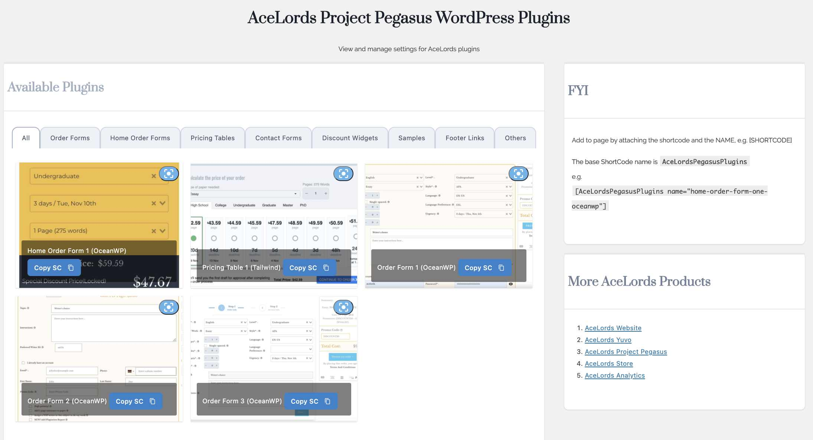

# AceLords Pegasus WordPress Plugin
AceLords Pegasus is a complete and complex freelancing-centered system aimed at complementing AceLords' Project Pegasus WordPress Plugins for complementing AceLords' Project Pegasus.

## Available Plugins 
1. Home Page Order 1 (OceanWP)
2. Home Page Order 2 (TailWind)
3. Home Page Order 3 (OceanWP)
4. Pricing Table 1 (TailWind)
5. Order Page 1 (OceanWP)
6. Order Page 2 (OceanWP)
7. Order Page 3 (OceanWP)
8. Order Page 4 (OceanWP)
9. Order Page 5 (OceanWP)
10. Order Page 6 (OceanWP)
11. Order Page 7 (OceanWP)
12. Order Page 8 (OceanWP)
13. Order Page 9 (OceanWP)
14. Order Page 10 (OceanWP)
15. Order Page 11 (OceanWP)
16. Samples 1 (Tailwind)
17. Default Writers 1 (Tailwind)
18. Contact Form 1 (Tailwind)
19. Contact Form 2 (Tailwind)
20. Reviews 1 (Tailwind)
21. Reviews 2 
22. Reviews 3 
23. Reviews 4 
24. Reviews 5 
25. Reviews 6 

## Installation
For first time installs and activation, you need to contact the developers before. 
For subsequent installs(updates), click on the 'update now' button in the plugins page. 
Alternatively, you can head over to github and download the zipped file.

## Dev Tips
### Theming [In Development]
To harmonize with the website theme colors, the following classes shall be applied, and as such need to be defined in the parent theme.
- theme-bg-primary
- theme-bg-primary-light
- CSS variables 
  - (--theme-primary-color)
  - (--e-global-color-primary) - For elementor-enabled sites

## Contributing
- [AceLords](https://www.acelords.space)

## License
- AceLords Proprietary License

## Report Bugs
- [AceLords Support Mail](mailto:support@acelords.space)
- [AceLords Business Mail](mailto:info@acelords.space)
